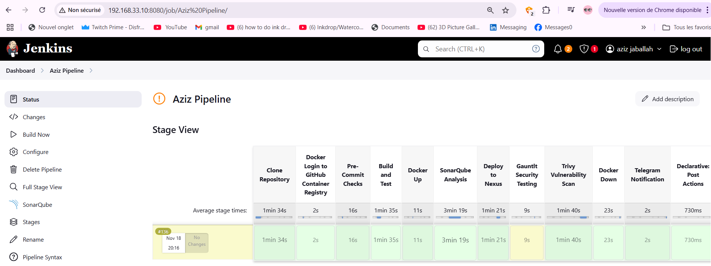
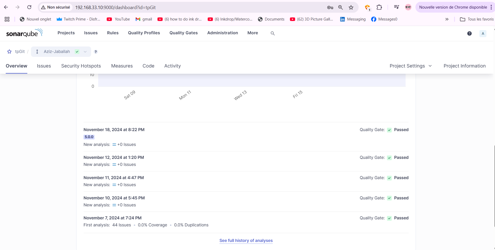
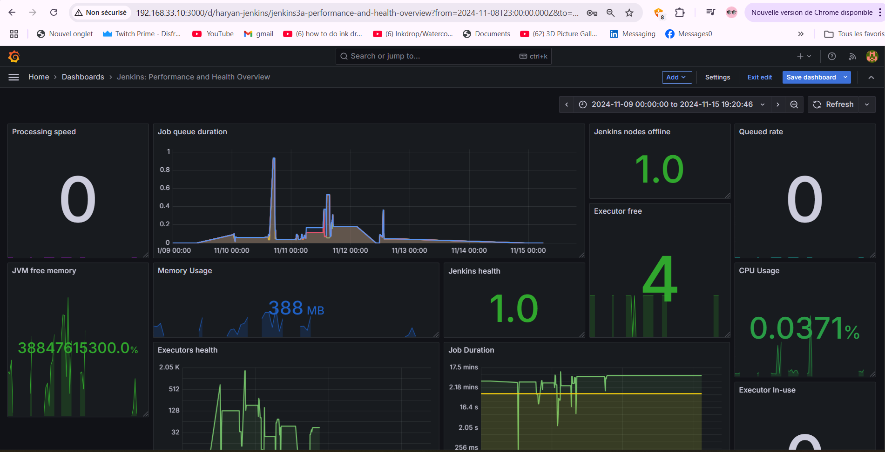
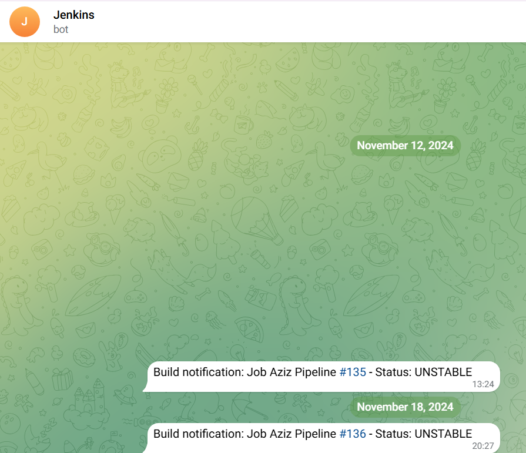
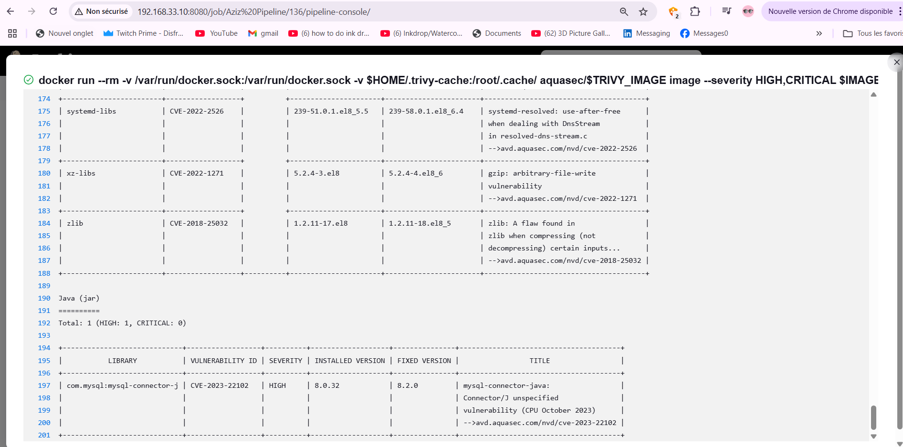

# 📷 Visual Results & Monitoring Snapshots

## 📊 Jenkins Pipeline View
Below is a screenshot of the Jenkins Pipeline in action with all stages completed successfully:



---

## 📦 SonarQube Static Code Analysis
The SonarQube dashboard showing a successful analysis with zero issues:



---

## 📈 Grafana Monitoring Dashboard
Here is the Grafana dashboard showing Jenkins performance and system health metrics:



---

## 📬 Telegram Notifications
Jenkins sends a message after the pipeline completes with the build status to a Telegram bot:



---

## 🛡️ Trivy Vulnerability Report
Trivy detected vulnerabilities in the Docker image and generated a detailed report within the Jenkins job:



---

## 📂 Repository Structure
Here's the current structure of this repository:

```
projects/
├── DeepSeek-Docker-GPU/
│   ├── monitoring.md
│   └── ...
└── devsecops-pipeline/
    ├── README.md
    ├── installation.md
    ├── monitoring.md
    ├── images/
    │   ├── jenkins.png
    │   ├── Sonarqube.png
    │   ├── grafana.png
    │   ├── telegram.png
    │   └── trivy.png
```

---

## 📘 Continue Reading

➡️ [Read about next-gen-soc project](../../next-gen-soc-banking/README.md)  
➡️ [If you arrived here, You would probably be interested in lOCAL DEEPSEEK project](../DeepSeek-Docker-GPU/README.md)
